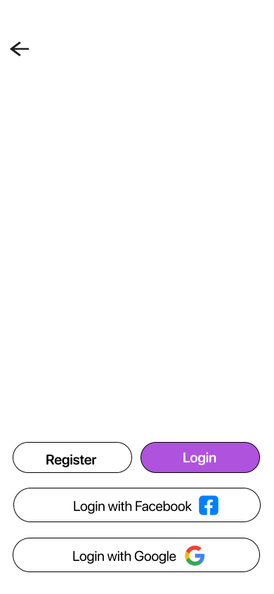
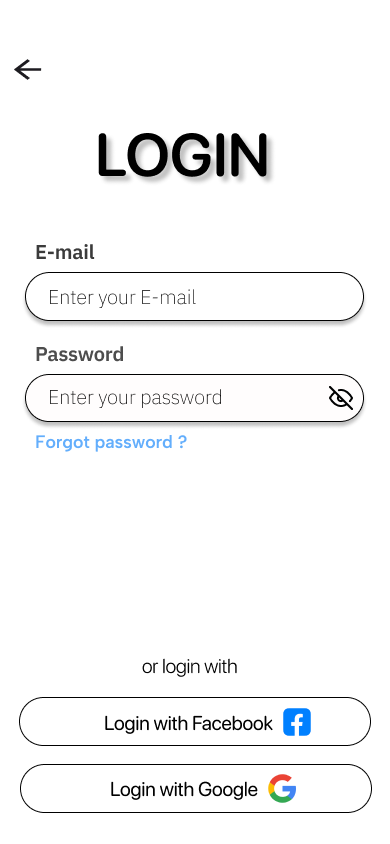
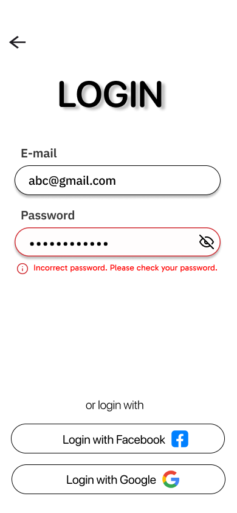
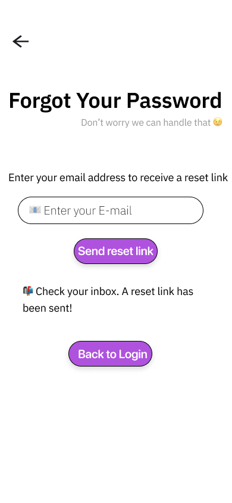
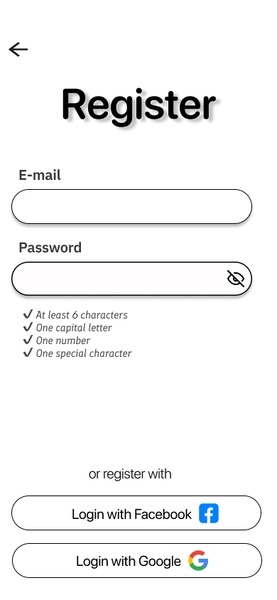

# figma-login-ui
A simple login + forgot password UI made in Figma
# 🔐 Login UI Design in Figma

This is a simple login + forgot password UI flow made using Figma.

## 🔗 Live Preview on Figma

👉 [View Full Design on Figma](https://www.figma.com/design/WWFS6Msxl800ohCG5frIzb/Login?node-id=0-101&t=yy6Xg6BTDitzY52K-1)
## 🔗 Prototype on Figma
👉 [View Prototype on Figma](https://www.figma.com/proto/WWFS6Msxl800ohCG5frIzb/Login?node-id=0-20&t=yy6Xg6BTDitzY52K-1)

## 📸 Screenshots

### Homepage

### Login Page

### Forgot Password

### Register Page

---

## 💡 Tools Used

- Figma (for UI Design)
- GitHub (for version control + portfolio)

---

## ✨ Author

Designed by Drishan Dwivedi
